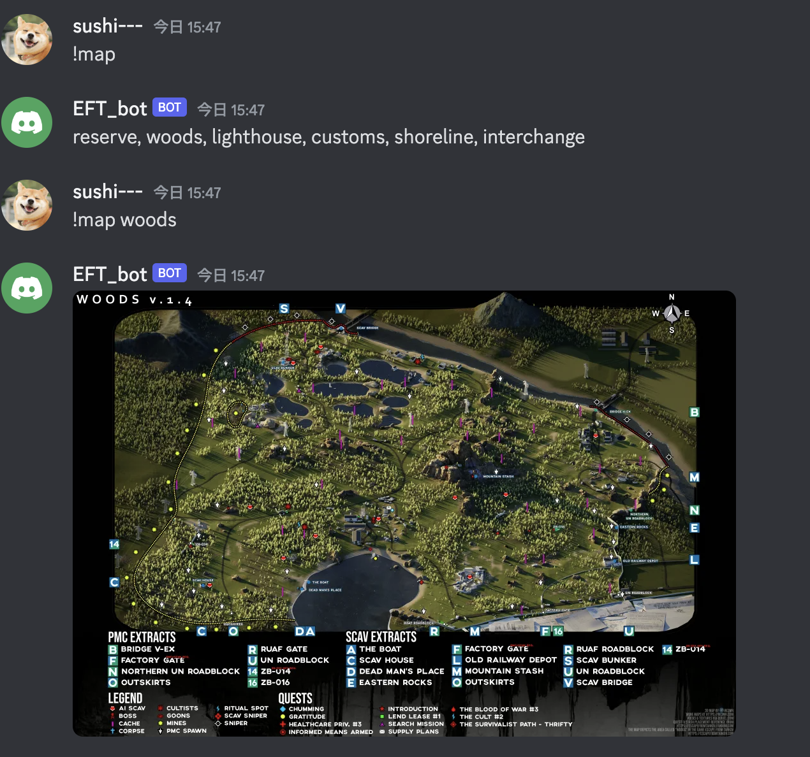

# Escape_from_Trakov_maps_DiscordBot

## Demo


## Dependencies
- discord.js:   14.14.1
- dotenv    :   16.4.5
- ts-pattern:   5.0.8

## Installation
```bash
npm i @ei-sugimoto/eft_discordbot
```

## Usage
```typescript
import {EFTMapsMessage, Map} from '@ei-sugimoto/eft_discordbot'

client.on('messageCreate', async (message: Message) => {
    if (message.author.bot) return
    const eftMapsMessage = new EFTMapsMessage()
    const map = message.content.split(' ')[1] as Map
    eftMapsMessage.sendMap(message, map)
})

```

## License
MIT

## Author
ei-sugimoto

## supplement
- The images of this package are provided under the Creative Commons Attribution-NonCommercial-ShareAlike license by Fandom's Escape from Tarkov Wiki.
- https://escapefromtarkov.fandom.com/wiki/Escape_from_Tarkov_Wiki

